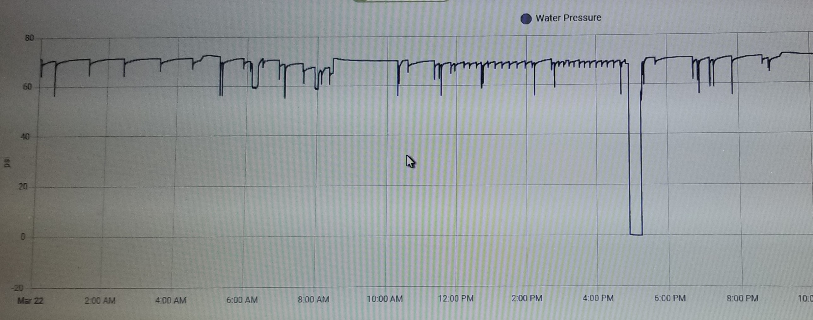

# Smart-Home-Water-Leak-Detector

- This project starts with Yang's project at https://github.com/heyitsyang/Whole-House-Water-Leak-Controller .  Optional adaptations:
	- Buck converter is replaced by dedicated 5v usb supply wall wart for ESP8266.
  	- Standard electronics enclosure is substituted for custom 3D printed electronics enclosure.

- Observations
	 
  	- Water pressure varies during the course of a day, increasing during the night and decreasing in the morning.
  	- Water pressure increasses when water heater is active.
  	- Water pressure recovers slowly after demand if there is a pressure regulator.
  	- Water flow may not be detected by fixed threshhold for slower flow rates or for periods of higher pressure.
  	  
- How small a leak can we detect without using an impeller?"
	- Water flow duration was measured under various conditions (flush, shower, laundry, dishes, etc.)
	- An adaptive threshhold was implemented to close the main valve 10 minutes after detecting water flow.
 	- Motion detected in the bathrooms or kitchen cause a 20 minute grace period (for showers, proof of consciousness, etc.).
   
 		- 75 ml/min flow is detected in 80 seconds. Total leak = 75(80/60) + 10(75) = 850 ml (3+ cups).
     		- 40 ml/min flow is detected in 6 minutes.  Total leak = 6(40) +10(40) = 640 ml (<3 cups). 
       		- 24 ml/min flow (22 drips/10 sec) is detected in 11 minutes.  Total leak = 11(24) + 10(24) = 504 ml (2 cups).
  
- How to interpret nightly static leakage test results
	- Typical nightly results range betwwen -.06 and -.2 psi at my house.
 	- pressure decrease will be greater if the test is run soon after the water heater is activated. 
    	- A 24 ml/min leak will cause a 3.44 psi drop during the nightly static leakage test.
    
- Adaptive threshhold theory of operation
  	- Leaky peak - If pressure (P) rises above the peak value, the calculated peak pressure is set equal P.
  		- The peak pressure stays constant for the next 10 minutes unless P exceeds it before then.
  	 	- After 10 minutes, the peak is reduced .25 psi if it doesn't hit P.
  		- As P falls, the calculated peak pressure falls at a slower rate.  Hence, the term leaky peak.
  	- Threshhold - The threshhold that defines flow is set at 1 psi below the most recent calculated leaky peak pressure.
  	- Flow - When P goes below the threshhold, water is flowing and the 10 minute flow timer begins.
  	- Motion Sensors - reset the flow timer when motion is detected.
  	- 
  	- There is a similar mechanism to calculate the threshhold when the flow stops and the pressure rises again.
  
  - Examples:
  	- The folllowing cellphone screenshot was taken as pressure was increasing.
   	- The peak and threshhold are recalculated each time the pressure increases above the prior peak.

	- 

	- The following plot shows the pressure decreasing at a rate of ,,, and the peak is reduced .25 psi / 10 min

	- 
 
## System Operation
- Based on appliance signatures, a 10 minute flow causes the valve to shut down unless the following conditions exist:
	- Motion is detected in the bathroom or kitchens, causing a 20 minute standby period.
	- The manual override switch has been actuated.

## Adaptive Threshhold Theory of Operation
- The adaptive threshhold is based on a "leaky peak detector".
 	- It rides 1 psi below the incoming MAX psi as the incoming psi slowly ebbs and flows.
  	- A faster then normal drop in psi below the threshold initiates the 10 minute flow timer and also sets second thresshold to determine when the flow has stopped.
   	- If the flow timer reached 10 minutes and the standby timer is not active, the main valve is shut off.
   	- Motion in the kitchen or bathroom overrides the operation by restting the standby timer.
   	- Time durations of wash machine and dishwasher cycles were measured to determine timer cutoffs.
- Detection of moisture by external sensors caouse immediate valve closure. 

## Flow Duration Study
- Overnight activity followed by shower at 5am.
	- Note visual sign of failing toilet seal, which was seen before heard, enabling repair before failure!
   

- Overnight activity followed by 2 toilet flushes, shower

- Wash Machine and dishwasher flow signatures indicate max flow duration is less than 5 minutes:

- Adaptive Threshhold tracking slow leak
  

