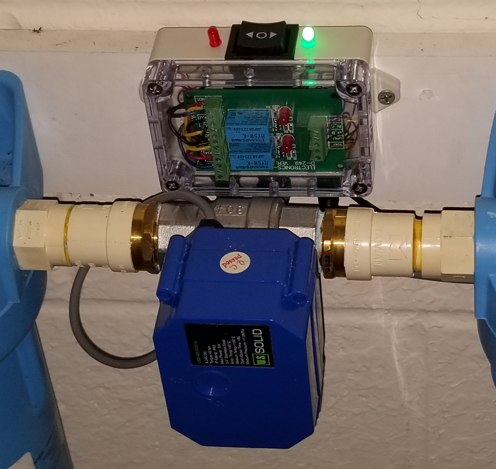
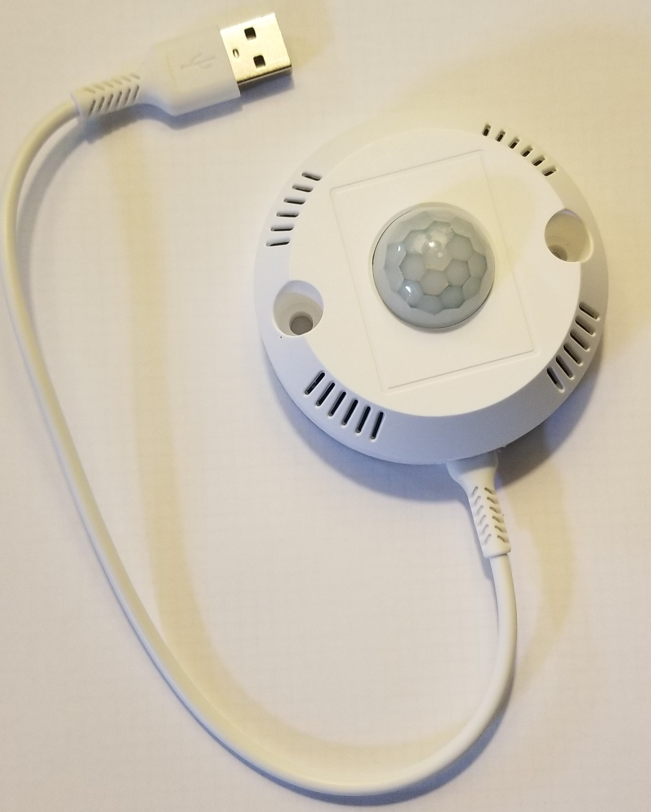

# Watermain Adaptive Threshold Implementation

- This project starts with Yang's project at https://github.com/heyitsyang/Whole-House-Water-Leak-Controller .
	- Optional adaptations:
		- Buck converter is replaced by dedicated 5v usb supply wall wart for ESP8266.
  		- Standard enclosure is substituted for custom 3D printed electronics enclosure.
                
    
- Observations
	- Typical 24 hour pressure profile:
  
 	

  	- Water pressure varies several psi during the course of a day.
  	- Water pressure spikes when water heater is active.
  	- Water pressure recovers slowly after demand if there is a pressure regulator.
  	- Water flow may not be detected by a static threshhold for slower flow rates or during periods of higher pressure.
  	  
## How small a leak can we detect without using an impeller?
- Water flow duration was measured under various conditions (flush, shower, laundry, dishes, etc.)
	- An adaptive threshhold was devised to close the main valve 10 minutes after detecting water flow.
 	- Motion detected in the bathrooms or kitchen cause a 20 minute grace period (for showers, proof of consciousness, etc.).
  	- Leak vol = leak rate x flow detection time + 10 min x leak rate + water residue after valve closes (approx 20 fl oz = 625 ml) 
 	- 75 ml/min flow is detected in 80 seconds. Total leak = 75(80/60) + 10(75) + 625 = 1475 ml (=6 cups).
        - 40 ml/min flow is detected in 6 minutes.  Total leak = 6(40) +10(40) + 625 = 1265 ml (=5 cups).
       	- 24 ml/min flow (22 drips/10 sec) is detected in 11 minutes.  Total leak = 11(24) + 10(24) + 625 = 1129 ml (<5 cups).
  	- Wide open faucet 5.3 liter/min flow would take 10 minutes to shut down.  Leak = 10(5.3)+.625 = 54 liters (14 gal).
  	 	- Therefore use moisture sensors to close valve immediately for larger volumes.
  	    
## Static pressure test results:

- Typical nightly results range betwwen -.03 and -.15 psi at my house.

- Pressure decrease is greater (-. 38 psi +-) if the test is run soon after the water heater has been activated and the pressure tank has peaked and is on the downswing. 

- A 24 ml/min leak causes a 3.44 psi drop during the nightly static pressure test under normal conditions.
    
## Adaptive Threshhold Theory of Operation
- The adaptive threshhold is based on a "leaky peak detector".
  	- Leaky peak - If pressure (P) rises above the peak value, the calculated peak pressure is set equal P.
  		- The peak pressure stays constant for the next 10 minutes unless P exceeds it before then.
  	 	- After 10 minutes, the peak is reduced .25 psi if it doesn't go less than P.
  		- If P rate of decrease exceeds .25psi/10 min, the calculated peak pressure decreases at a slower rate.  Hence, the term leaky peak.
  	- Threshhold (T) - The threshhold that defines flow is set at 1 psi below the most recent calculated leaky peak pressure.
  	- Flow - When P goes below the threshhold, the 10 minute flow timer begins.  After 10 minutes, the valve is closed.
  	- Motion Sensors reset the flow timer when motion is detected.
  	- There is a similar mechanism to determine the threshhold when the flow stops and the pressure rises again.
  
  - Examples:
  	
   	- The peak and threshhold (T) are recalculated each time the pressure increases above the prior peak.

	  
	  

	- The following plot shows the pressure decreasing at a rate of .125 psi/10 min; the peak is reduced .25 psi / 10 min until the two meet.

  	- The plots above and below demonstrate an example of the threshold tracking the normal ebb and flow of psi without tripping the flow threshld.

	  

   	- Adaptive Threshold operation through two demand cycles:
       
	- We see that at 8:11 and 8:27 when pressure drops below threshold (flow begins) the threshold flips to above the psi to define when flow stops.
 
   	- At around 8:14 and 8:33 the psi goes above the threshold, (flow stops), and the threshhold once again tracks below the newest max psi.
      
	
 
## System Operation
- Based on appliance signatures, a 10 minute flow causes the valve to shut down unless the following conditions exist:
	- Motion is detected in the bathroom or kitchens, causing a 20 minute standby period.
	- The manual override switch has been actuated.
	- Detection of moisture by external sensors cause immediate valve closure.
 	- Monitor daily leakage test and graphical representation to catch other issues.

## Flow Duration Study
- Overnight activity followed by shower at 6 am.
	- Note visual sign of failing toilet seal, which was seen before heard:
      

- This is a great visual tool to monitor the water system.  That seal is getting worse!  Still can not hear it to identify it. 

- Wash Machine flow and dishwasher signatures indicate max flow duration is only a few minutes.
	- Laundry:

	- Dishwasher:

- Morning routine including shower:

## Hardware
- PIR motion sensors with optional temperature/humidity report to Home Assistant, causing a 20 minute standby.
- Be sure to use a 100nf decoupling capacitor across temp sensor Vcc and Gnd to prevent spurious PIR hits.
- Use most any ESPxyz here.  Standardizing with ESP32 keeps my life simple, if inelegant.
- Add a white Ailkin USB plug and some velcro tape to the assembly and plug it in.
	- The blue LED is easily visible when motion is detected.
- Software for the PIR sensor is at https://github.com/Bobbo117/Cellular-IoT-Monitor/blob/main/src/AmbientAP/AmbientAP.ino .
	-  Use ID 4,5,and 6 for 3 PIR sensors
 	-  Enable HA so that it will communicate with home assistant. 	

## Software 
 - Adjustments to the original Watermain software are minimal:
	- New variable definitions and mqtt topics are appended at the beginning.
  	- New command topics are appended to the mqtt callback function.
	- New processing is appended at the end of the loop() function.
	- Two new threshold functions are appended at the end of the code after the loop function.
  
## Tips, Tricks, and Traps

- If you take a long shower (> 10 minutes), verify that the bathroom motion sensor sees you!  Look for the blue light.
- For showers longer than 20 minutes, don't forget to wave at the motion sensor once in a while.
- Activate the Manual Override switch in the HA screen for the powerwash vendor or other vendors using water.
- Keep an eye on the motion sensors.  If one stops working, you could be in for a surprise in the shower at about 10 minutes.

## Results

- This system has operated 6 months with no unanticipated shutoffs.  
- Very slow leak rates may not close the valve, especially if the pressure happens to be on the up cycle.
   	- In this case, the nightly Static Pressure Test gives an abnormally high reading that should be followed up.

## Home Assistant Screens

- These screens along with Yang's will help you navigate your way through the software:

## Conclusions

- While this adaptive threshold mechanism is not as sensitive as an impeller, it provides an added layer of protection without the expense.
  
- This is a great project for those who want to become as one with their plumbing system while simultaneously protecting against one of the more frequent and expensive insurance claims. 

